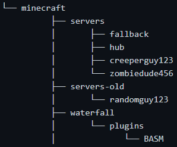

# BASM Outline

This file will outline the major functionality of the plugin and serve as a list of potential future features it may have

# Outline of how the plugin will work:
- `/create` will first check the UUID of the player running the command against a dictionary of player UUIDs and server IDs (`server_dictionary.json`) to check if the player already has a private server. The `/create` command will only work in a configurable hub server. The max number of servers across the network as well as the max server count per player will be configurable in the `config.yml`. In the `server_dictionary.json` file there will be a field that will determine if a player can bypass the server limit.

- The `/create` command will take arguments such as a `server nickname`, `discord username with discriminator`, and `server MOTD`, however if these arguments are not supplied, the `server nickname` will be set to the player username, the `discord username` will be set to null, and the `server MOTD` will be set to `{basm_server_owner_username}'s Private Server`. The player will be able to change these values later by running the command `/basm edit [nickname/discord/motd] [user supplied value]`. To set the server MOTD, the plugin will search for the string `serverMOTD` in the proper `server.properties`.

- If the player does not already have a server, the plugin will make a copy of the `server_template` directory and name rename the new server directory to the username of the player. Once the files are copied it will add the player to the `whitelist.json` and the `ops.json`. The plugin will then select the next port number in the sequence and update the `server.properties`. The plugin will look for the string `serverPort` in `server.properties` and replace that string with the correct port. The correct port being the next one in numerical order from the last added server. Then it will update the `start.sh` screen name to the username of the player. (This might change in the future)

- If the player already has a server, the plugin will display a configurable error message to the player that they already have a server. The plugin will then prompt the player to connect to their server with a configurable message where {serverName} is a placeholder for the server name in the bungeecord `config.yml`. 

- The command `/basm delete` will ask the user if they actually want to delete their server, and prompt them to run the command `/basm delete confirm` to confirm deletion. The plugin will then shut down the server if it is running, move the server to be deleted to a new configurable directory and remove the servers information from the bungeecord `config.yml`

- If a player tries to connect to a server that is not running, the plugin will display a configurable error message to the player and ask if the player wants to start their server. If the user runs the command `/start` the plugin will run the appropriate `start.sh` script and then notify the player when the server is online and they can connect to it. 

- If a player does not log into their server for a configurable delay in `config.yml`, (Checked by monitoring the `TSLL`) it will be safely shut down. The next time the player logs in they will be notified that their server was inactive and shut down, then ask if the player wants to start their server again. Furthermore if a player does not log into their server for another configurable delay, the plugin will move the server to a configurable directory for cold storage. If the player then tries to use the `/create` command, it will inform the player that their server has been moved to cold storage and can not be started. If the player joins the network again, they will get a message that their server was moved to deep storage and to send an email to a configurable email in `config.yml` or join a discord server from a configurable link in `config.yml` and request their server be moved back. 

- The `TSLL` will be monitored by recording the UTC time the player last logged in. Every 30 minutes, the plugin will ping a NTP server, or grab the current system time, and check it against the list of players with private servers (`server_dictionary.json`). The time difference will be recorded in `server_dictionary.json` as a field assigned to each server. (Example config coming soon)

- The `/basm update [username]` command is used to update the server jar for a specific server to the version of paper that is in the plugins directory, named `latest_paper.jar`. It does this by shutting down the specified server, and overwriting the current server jar with the new `latest_paper.jar`. It will then start the server again and send a configurable message when done.

- All configurable messages/notifications/warnings will be defined in a `messages.yml` file.

# Possible future features
- In a future update the plugin may be able to send data to a configurable discord bot that will let network admins know about a variety of things such as performance metrics, when new servers are created, deleted, modified, shut down, and started
- The ability for users to upload their own plugins.

# Permission nodes:
- `basm.admin`  --- Allows player to use all basm commands, and modify all basm created servers and their properties
- `basm.server_owner`  --- Allows player to manage the servers they own
- `basm.global_count_bypass`  --- Allows player to bypass the global limit to the number of basm cerated servers
- `basm.user_count_bypass`  --- Allows the player to bypass the user limit to the number of basm created servers

# Placeholders:
- `{basm_server_owner_username}`
- `{basm_server_nickname}`
- `{basm_server_discord_id}`
- `{basm_server_MOTD}`

# Proposed Commands:
- `/basm`  --- displays all basm commands
- `/basm create` or `/create`  --- Creates a private server
- `/basm delete` or `/delete`  --- Deletes a private server
- `/basm edit [nickname/discord/motd] [user supplied value]`  --- Allows a server owner to edit the details of their server
- `/basm setgloballimit`  --- Sets the global limit on the number of servers
- `/basm setuserlimit [username] [number]`  --- Sets the limit of the number of servers a certain player can have
- `/basm [stop/start] [all/username]`  ---  Stops or starts all basm servers or just the one specified
- `/basm [remove/restore] [username]`  ---  Moves or restores a server from cold storage
- `/basm update [username]`  --- Updates a specific server to the new version of paper
- `/basm version`  --- Displays the current basm plugin version
- `/basm info`  ---  Displays the credits and the github url of where to find more information on this plugin 

# Proposed file structure:
The proposed high level file structure will look something like this  

